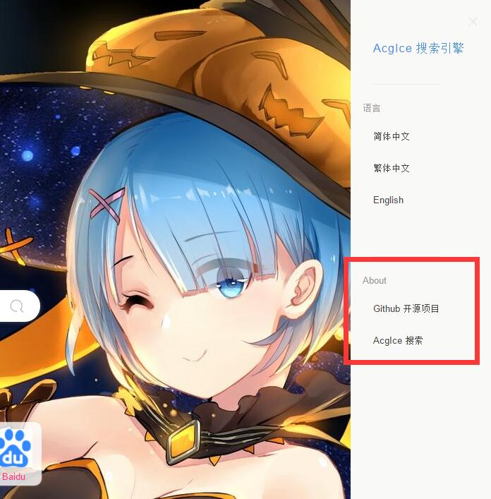

# AcgIce搜索开源说明

AcgIce搜索是使用PHP7开发的一款多语言聚合搜索引擎，为了更好的发展所以开源，协议采用AGPL-3.0，希望您可以遵守这个开源协议。欢迎一起开发和维护Acgice搜索。

网址：https://www.acgice.com/


受到 秘迹搜索 的 启发，使用了PHP制作了此项目（有个人喷PHP就是垃圾，我就用PHP做了这个打了他的脸）

项目前端参考于 秘迹搜索：https://github.com/entropage/mijisou/


## 环境要求

```
PHP > 7.3
Memcache Or Redis
```

## 环境依赖

- ThinkPHP 5.0.24版本 http://www.thinkphp.cn/  自行下载
- AcgIce 扩展（必须安装）：https://github.com/orzice/acgice-extend  使用以下命令，会自动搭建依赖。

```
composer require acgice/acgice-extend
```


HTTP客户端采用 GuzzleHttp，当你安装了 AcgIce扩展， 默认就安装了。

Guzzle文档：https://guzzle-cn.readthedocs.io/zh_CN/latest/overview.html


## 协议要求

请求您保留以下内容。

允许商业化。




## Acgice搜索反馈渠道和联系方式

```
QQ: 1073519986 

邮件: admin@orzice.com

公司：许昌市冰尘网络科技有限公司
```


由此可以只用写搜索扩展（核心）就好了，获取数据，系统会自动处理进行展现的。